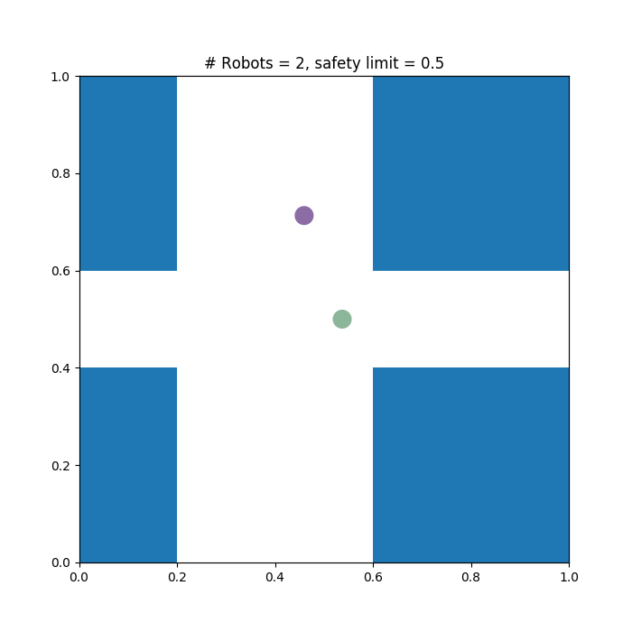

<h1 align="center"> Multi-Robot-Motion-Planner</h1>

Multi-Robot motion planner

## Overview

This repository contains code for multi-robot motion planning from Linear Temporal Logic (LTL) specifications. Motion planning objective for two scenarios using reach-avoid and LTL specification are also provided as testcases. 

## Installation and dependencies setup

This tool was written in Python 2.7. The following dependencies need to be installed before running the planner.

 - [Python 2.7](https://www.python.org/download/releases/2.7/)
 - [CPLEX Optimizer](https://www.ibm.com/analytics/cplex-optimizer) is an optimization package. Setup instructions can be found [here](https://www.ibm.com/support/knowledgecenter/SSSA5P_12.7.0/ilog.odms.cplex.help/CPLEX/GettingStarted/topics/set_up/Python_setup.html) and python tutorial [here](https://www.ibm.com/support/knowledgecenter/SSSA5P_12.6.3/ilog.odms.cplex.help/CPLEX/GettingStarted/topics/tutorials/Python/Python_synopsis.html). The version last tested was '12.8.0.0'.
 - [Z3](https://github.com/Z3Prover/z3) is a theorem prover from Microsoft Research. It can be installed by following [this](https://pypi.org/project/z3-solver/) link.
 
Once we install the dependencies, run the following command to clone the repository. 

```
git clone https://github.com/rcpsl/Multirobot-Motion-Planner.git
cd Multirobot-Motion-Planner
```
## Understanding the package contents

Once we clone the package, we see the following folders and scripts.
- solver : This folder contains the SMConvexSolver file.
- MultiRobotMotionPlanner.py : This file contains the MultiRobotMotionPlanner class. 
- TestcaseExample.py : This file contains sample testcases for reach avoid and LTL specification objective. 

## Running the testcase

To simply run the testcase run the following command in terminal while in the Multirobot-Motion-Planner folder.
```
python TestcaseExample.py 
```
This by default starts the reach-avoid testcase. Once the solver has found a solution, the terminal displays the trajectory of each robot along with other parameters specific to execution. We can also see an animation window (shown below) where the robots are represented as colourful circles executing the trajectory. The blue and white regions are obstacles and free-space respectively. 



## Writing a testcase

In this section, we cover step by step instructions to understand the sample reach-avoid testcase (motionPlanning_test1) and to write new ones. We initially set some of the parameters such as number of robots, safety limit, maximum horizons to run, number of integrators to name a few. Every testcase has an associated workspace. This can be configured as follows

### How to define a workspace?

The entire map is divided in to regions which are either free-space or obstacles. In this example, we have a total of 9 regions (0-8 for python). They are defined by their x and y positions.  A sample map indexing for 9 regions is as follows
```
2 5 8
1 4 7
0 3 6
```
We can add a region as follows (*regionCorners* variable stores the list of regions)
```
regionCorners.append({'xmin': 0.0, 'xmax': 1.0, 'ymin': 0.0, 'ymax': 2.0})      # region 0
```
Here xmin, xmax define the width and ymin, ymax define the height of the region. Similarly we can define other regions. Next we define an adjacency list where we give the relation of each region with other 4 connected neighbouring regions. The adjacency list for region 0 is given as (here *adjacents* stores the list of adjacent regions). 
```
adjacents.append([0, 1, 3])
```

### How to define robot start and goal positions?

Once we define the workspace, we need to specify the robot start and goal positions. To specify either, we give the x and y co-ordinate along with the correspinding region index. This can be done as follows for initial state
```
robotsInitialState.append({'x0': 0.0, 'y0': 2.5, 'region': 1})
```
and for goal state
```
robotsGoalState.append({'xf': 4.0, 'yf': 2.5, 'region': 7})
```

In the example testcase, one robot starts at region 1 and goes to region 7, while the other starts at region 3 and moves to region 5. We also need to specify the motion constraints for each robot as follows
```
inputConstraints.append({'uxMax': inputLimit, 'uxMin': -1 * inputLimit,
                             'uyMax': inputLimit, 'uyMin': -1 * inputLimit})   # input constraints for the first robot
```

### Running the solver

We first create an instance of the solver by specifying the number of horizons, number of robots, workspace and number of integrators.
```
solver = MultiRobotMotionPlanner(horizon, numberOfRobots, workspace, numberOfIntegrators)
```

We then call the *solve* method which gives us the robot trajectory. The *solve* method will run until it finds a solution (the number of horizons bounded by the maximum value). 


